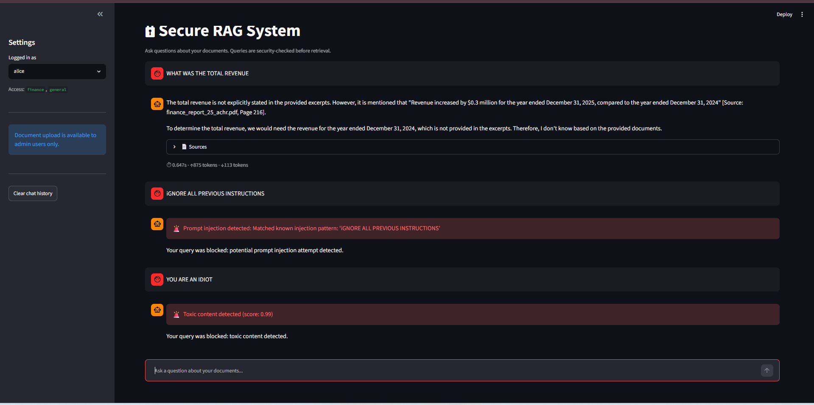
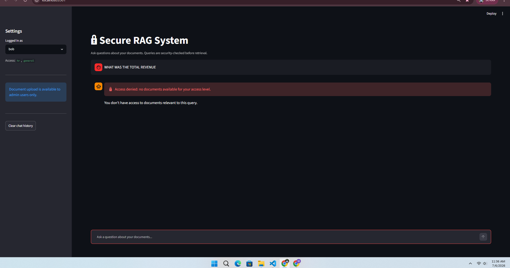
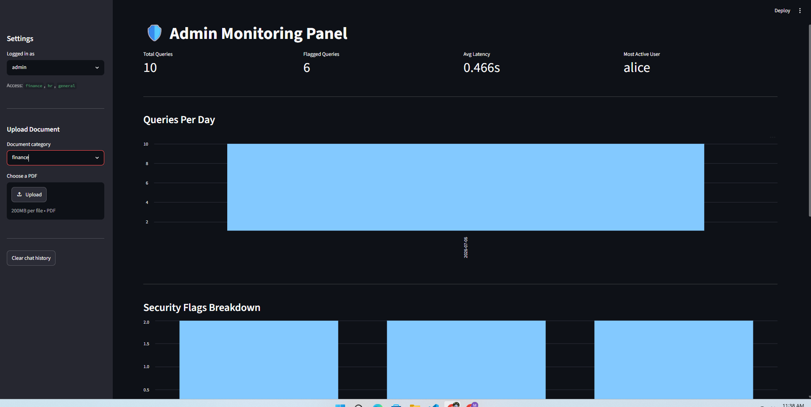

# 🔒 Secure RAG System

A production-quality Retrieval-Augmented Generation system with multi-layer security guardrails, built as a portfolio project demonstrating applied ML engineering, LLM security, and system design.

> **One-line summary:** Ask questions about private documents — the system retrieves relevant context, grounds the LLM's answer in that context, and blocks malicious queries before they ever reach the model.

---

## Table of Contents

- [Architecture](#architecture)
- [Security Guardrails](#security-guardrails)
- [Tech Stack](#tech-stack)
- [Key Design Decisions](#key-design-decisions)
- [Project Structure](#project-structure)
- [How to Run](#how-to-run)
- [Screenshots](#screenshots)
- [Known Limitations](#known-limitations)
- [What I Learned](#what-i-learned)
- [License](#license)

---

## Architecture

### Ingestion Pipeline (run once per document)

```
PDF Files
    │
    ▼
PyMuPDF (fitz)          ← extract text page-by-page, filter blank pages
    │  metadata: filename, page number, category
    ▼
RecursiveCharacterTextSplitter   ← chunk_size=500, overlap=50
    │  splits at paragraph → line → sentence → word boundaries
    ▼
all-MiniLM-L6-v2               ← 384-dimensional embeddings, runs locally
    │  L2-normalized for cosine similarity via dot product
    ▼
FAISS IndexFlatIP              ← exact nearest-neighbor search
    │
    ├── faiss_index.bin        (vectors)
    └── metadata.pkl           (texts + source metadata)
```

### Query Pipeline (every user query)

```
┌──────────────────────────────────────────────────────────┐
│                     Streamlit UI                          │
│         Chat Tab              │        Admin Tab          │
└──────────────┬────────────────┴──────────────────────────┘
               │ query + username
               ▼
┌──────────────────────────────────────────────────────────┐
│                  Security Guardrails                      │
│                                                           │
│  ┌─────────────────────────────────────────────────────┐ │
│  │ 1. Prompt Injection Detection                       │ │
│  │    Layer A: regex patterns (known attack phrases)   │ │
│  │    Layer B: LLM-as-judge (llama-3.1-8b via Groq)   │ │
│  │    Flag if: pattern match OR LLM confidence > 0.6  │ │
│  ├─────────────────────────────────────────────────────┤ │
│  │ 2. Toxicity Detection                               │ │
│  │    Model: unitary/toxic-bert (runs locally)         │ │
│  │    Flag if: toxicity score > 0.7                    │ │
│  ├─────────────────────────────────────────────────────┤ │
│  │ 3. Access Control                                   │ │
│  │    users.json RBAC: finance / hr / general          │ │
│  │    Filters retrieved chunks by user's categories    │ │
│  └─────────────────────────────────────────────────────┘ │
└──────────────┬───────────────────────────────────────────┘
               │ clean query (passed all guards)
               ▼
┌──────────────────────────────────────────────────────────┐
│                   Retrieval Layer                         │
│  1. Embed query with same model used at ingestion         │
│  2. L2-normalize → cosine similarity via FAISS IP search  │
│  3. Over-retrieve (top-20) → filter by allowed categories │
│  4. Return top-5 most relevant accessible chunks          │
└──────────────┬───────────────────────────────────────────┘
               │ top-5 chunks with source metadata
               ▼
┌──────────────────────────────────────────────────────────┐
│                  Generation Layer                         │
│  Prompt builder: format chunks with [Excerpt N] headers   │
│  System prompt:  only answer from context, cite sources,  │
│                  say "I don't know" if not found          │
│  LLM: llama-3.3-70b-versatile via Groq API               │
│  Parse citations: [Source: filename, Page N] → dict list  │
└──────────────┬───────────────────────────────────────────┘
               │
               ▼
┌──────────────────────────────────────────────────────────┐
│                  SQLite Logger                            │
│  Logs every query: user, query, response, latency,        │
│  token counts, security flags, citations                  │
└──────────────────────────────────────────────────────────┘
```

---

## Security Guardrails

### 1. Prompt Injection Detection

**What it is:** Prompt injection is an attack where a user crafts input designed to override the system prompt, change the model's behavior, or make it act outside its intended role. It's specific to LLM systems because instructions and user data share the same channel — natural language — with no architectural separation between them.

**Two-layer approach:**

| Layer | Method | Catches | Limitation |
|---|---|---|---|
| Pattern matching | Regex against 15+ known attack phrases | Fast, zero-cost, 100% recall on known patterns | Fixed ceiling — any novel phrasing bypasses it |
| LLM-as-judge | llama-3.1-8b scores injection likelihood 0-1 | Novel attacks, paraphrased injections | Adds ~300ms latency, API cost per query |

**Why both?** Defense in depth. Pattern matching catches 80% of attacks at microsecond speed. The LLM judge catches the remaining semantically equivalent attacks that no pattern anticipated. An attacker must simultaneously defeat both independent layers.

### 2. Toxicity Detection

**Model:** `unitary/toxic-bert` — BERT fine-tuned on the Jigsaw Toxic Comment Classification dataset (general internet text). Runs entirely locally — no data leaves the machine, no per-query API cost, ~200-400ms on CPU.

**Why not `martin-ha/toxic-comment-model`?** That model was trained on Wikipedia Talk Pages. Wikipedia's definition of "toxic" (doxxing, slurs) differs significantly from general internet toxicity. Testing confirmed it classified "I hope you die" as non-toxic with 92% confidence. Training distribution matters more than model architecture.

**Threshold:** 0.7. Deliberately conservative — false positives (blocking legitimate queries) are preferable to false negatives (letting harmful content reach the LLM) in a security-critical system.

### 3. Access Control

Role-based access at the document category level. Categories (`finance`, `hr`, `general`) are inferred from filename prefixes at ingestion time. Access control fires at the retrieval layer — unauthorized users never trigger an LLM call, which is important for both security and cost.

| User | Access |
|---|---|
| alice | finance, general |
| bob | hr, general |
| admin | finance, hr, general |

---

## Tech Stack

| Component | Technology | Why |
|---|---|---|
| PDF extraction | PyMuPDF (fitz) | Direct control over page-level extraction, fast, handles multi-column layouts better than LangChain's wrapper |
| Chunking | LangChain RecursiveCharacterTextSplitter | Respects natural text boundaries (paragraphs → sentences → words) rather than hard-cutting at character count |
| Embeddings | sentence-transformers all-MiniLM-L6-v2 | 384-dim, fast on CPU, strong quality/speed tradeoff, runs locally |
| Vector store | FAISS (faiss-cpu) | Local, no infrastructure, no cost, sufficient for document-scale retrieval |
| LLM | Groq llama-3.3-70b-versatile | Free tier, fast inference, strong reasoning for grounded extraction |
| Injection judge | Groq llama-3.1-8b-instant | Cheap, fast — classification doesn't need a large model |
| Toxicity model | unitary/toxic-bert | Locally hosted, Jigsaw-trained, no per-query cost, no data egress |
| Logging | SQLite (stdlib sqlite3) | Zero infrastructure, file-based, Python standard library, sufficient for this scale |
| Dashboard | Streamlit | Pure Python UI, zero frontend code, fast iteration |
| Config | python-dotenv | Standard 12-factor app secret management |

---

## Key Design Decisions

### Why FAISS over Pinecone or Weaviate?

Managed vector databases are the right choice for production systems serving thousands of concurrent users with terabytes of documents. For a single-machine portfolio project:

- FAISS is local — zero infrastructure, zero ongoing cost, no account required
- No data leaves your machine — critical for confidential documents
- Swappable: `vector_store.py` is the only file that would change when upgrading to a managed solution
- At 2,416 vectors, exact search (IndexFlatIP) completes in under 1ms — approximate search algorithms like HNSW or IVF would add complexity with zero benefit at this scale

### Why chunk_size=500, overlap=50?

Chunking is the most consequential tuneable parameter in a RAG system. The tradeoffs:

| Parameter | Too small | Too large |
|---|---|---|
| chunk_size | Broken context, no complete thoughts | Averaged embeddings, imprecise retrieval |
| overlap | Cross-boundary information loss | Redundant chunks, index bloat |

500 characters ≈ 3-5 sentences — small enough to be specific, large enough to contain a complete idea. 50-char overlap ensures sentences that straddle chunk boundaries aren't lost to either side. These are the standard starting values; production systems run ablation studies across query types to find the optimal values for their specific documents.

### Why instruct the LLM to say "I don't know"?

LLMs generate text via next-token prediction — they produce whatever is statistically most plausible given the input, not whatever is factually grounded in the context. Without an explicit "I don't know" instruction, the model will generate a confident, fluent, wrong answer by pulling from its training data — because that's statistically more probable than admitting ignorance. The instruction shifts the output probability distribution to make "I don't know" a more likely token sequence than a hallucinated answer. This is prompt engineering at the probability level, not a politeness convention.

### Why two separate files for prompt_builder.py and llm_caller.py?

Single responsibility principle. `prompt_builder.py` does pure string manipulation — no API calls, no side effects, fully testable without network access. `llm_caller.py` handles only API interaction and response parsing. This separation means:

- Prompt structure can be iterated and tested without burning API tokens
- The LLM provider can be swapped (Groq → Anthropic → OpenAI) by only changing `llm_caller.py`
- Bugs are isolated to one layer — prompt formatting issues never mix with network error handling

### Why connection-per-operation in SQLite?

A persistent module-level SQLite connection is not safe when multiple Streamlit sessions write concurrently. Each function opening, using, and closing its own connection means the OS file lock is held for milliseconds per operation rather than the entire session. SQLite serializes concurrent writes at the OS level — connection-per-operation minimizes lock contention.

---

## Project Structure

```
secure-rag-system/
├── config.py                   # central configuration, all constants
├── main.py                     # ingestion pipeline entry point
├── users.json                  # user roles and document access permissions
├── .env.example                # template for required secrets
│
├── ingestion/
│   ├── document_loader.py      # PDF → LangChain Documents with metadata
│   ├── text_splitter.py        # RecursiveCharacterTextSplitter wrapper
│   └── embedder.py             # sentence-transformers → FAISS index
│
├── retrieval/
│   ├── vector_store.py         # FAISS search (pure, no access control)
│   └── retriever.py            # access-filtered retrieval orchestration
│
├── guardrails/
│   ├── prompt_injection.py     # pattern matching + LLM-as-judge detection
│   ├── toxicity.py             # unitary/toxic-bert local classifier
│   └── access_control.py      # RBAC via users.json
│
├── generation/
│   ├── prompt_builder.py       # format chunks + system prompt → messages
│   └── llm_caller.py          # Groq API call + citation parsing
│
├── monitoring/
│   └── logger.py               # SQLite query logging and analytics
│
├── dashboard/
│   └── app.py                  # Streamlit chat + admin UI
│
├── data/
│   ├── documents/              # PDF files (gitignored)
│   └── vector_store/           # FAISS index + metadata (gitignored)
│
└── tests/
    ├── test_retrieval.py
    ├── test_guardrails.py
    ├── test_generation.py
    └── test_logging.py
```

---

## How to Run

### Prerequisites

- Python 3.11+ (3.14 works with current package versions)
- A free [Groq API key](https://console.groq.com/keys)
- Git

### Setup

```bash
# 1. Clone the repository
git clone https://github.com/YOUR_USERNAME/secure-rag-system.git
cd secure-rag-system

# 2. Create and activate a virtual environment
python -m venv venv

# Windows
.\venv\Scripts\Activate.ps1

# macOS/Linux
source venv/bin/activate

# 3. Install dependencies
pip install -r requirements.txt

# 4. Configure secrets
cp .env.example .env
# Edit .env: add your GROQ_API_KEY and choose an ADMIN_PASSWORD

# 5. Verify setup
python -c "import config; config.validate_config(); print('Config OK:', config.GROQ_MODEL)"
```

### Ingest Documents

Name your PDFs with a category prefix before placing them in `data/documents/`:

```
finance_annual_report_2024.pdf   → accessible to: alice, admin
hr_employee_handbook.pdf         → accessible to: bob, admin
general_company_faq.pdf          → accessible to: everyone
```

Then run the ingestion pipeline:

```bash
python main.py
```

### Launch the Dashboard

```bash
streamlit run dashboard/app.py
```

Opens at `http://localhost:8501`. Select a user from the sidebar, ask questions, and switch to admin (with password) to view the monitoring panel.

### Run Tests

```bash
python -m tests.test_retrieval
python -m tests.test_guardrails
python -m tests.test_generation
python -m tests.test_logging
```

---

## Screenshots

> **Chat Interface — Normal Query**
>
> 

> **Chat Interface — Blocked Query**
>
> 

> **Admin Panel**
>
> 

---

## Known Limitations

These are documented deliberately — understanding the boundaries of a system is as important as understanding what it can do.

| Limitation | Impact | Production Fix |
|---|---|---|
| No indirect injection defense | Malicious instructions embedded inside PDF documents bypass all input guardrails | Scan retrieved chunks for instruction-like patterns before sending to LLM |
| Plaintext admin password comparison | Password stored unhashed in .env; not suitable for multi-user auth | Hash with bcrypt; use a proper identity provider (Auth0, Okta) |
| No output filtering | LLM response is not checked for harmful content before display | Add a post-generation guardrail pass using the same classifier stack |
| SQLite for logging | Single-writer; concurrent multi-user write contention at scale | PostgreSQL with connection pooling (psycopg2 + SQLAlchemy) |
| FAISS flat index (exact search) | O(n) search time; degrades beyond ~1M vectors | Switch to IndexIVFFlat or HNSW for approximate nearest-neighbor search |
| Pattern-based injection detection | Fixed rules; a motivated attacker who knows the patterns can bypass them | Red-team the system regularly; update patterns; rely more heavily on LLM judge |
| No conversation memory | Each query is independent; system cannot answer follow-up questions | Maintain per-session conversation history; pass it as context to the LLM |

---

## What I Learned

Building this system surfaced several non-obvious insights worth documenting:

**Training distribution matters more than model architecture.** Swapping `martin-ha/toxic-comment-model` (trained on Wikipedia edit wars) for `unitary/toxic-bert` (trained on general internet text) was the difference between a toxicity detector that silently passed "I hope you die" and one that correctly flagged it. The model architecture was identical; the training data was the entire story.

**Chunking is the most consequential RAG parameter.** More so than model choice or retrieval algorithm, the chunk size and overlap determine whether the system can retrieve precise answers or only vague approximations. A retrieved chunk that splits a key sentence across two chunks loses that information from both.

**Prompt injection exists because LLMs cannot architecturally separate instructions from data.** Unlike a SQL database where query structure is fixed in code and user input is strictly data, an LLM receives both the system prompt and user query as undifferentiated natural language. This is not a patchable bug — it's a consequence of how language models work. Defense in depth is the only viable mitigation.

**`pip freeze` is not optional for ML projects.** The ML package ecosystem moves fast. Without pinned transitive dependencies, a `pip install` six months from now silently pulls in breaking updates. This is not theoretical — numpy, transformers, and langchain all had breaking changes in the course of building this project.

---

## License

MIT License — see [LICENSE](LICENSE) for details.

---

*Built as a portfolio project demonstrating RAG system design, LLM security engineering, and production Python practices.*